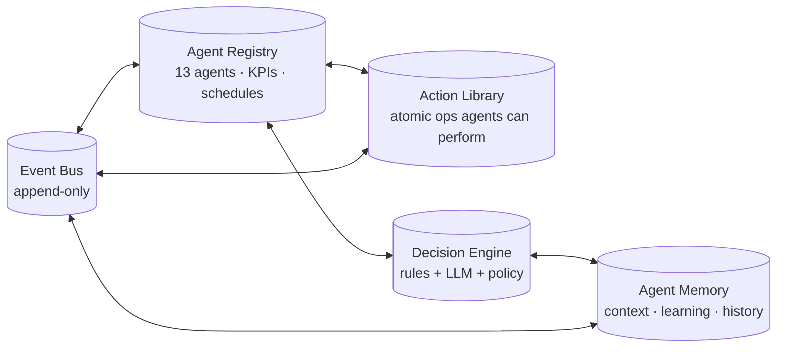
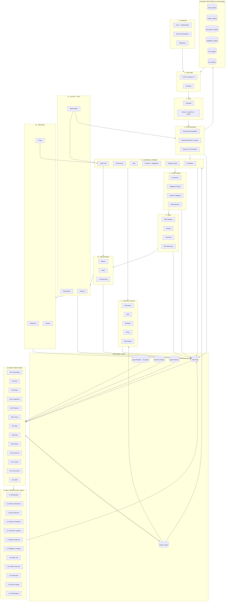

# Autonomous Operating Map — DOS-AIO GRC Platform

**Pre-implementation blueprint.** This document is the complete map showing how the platform becomes richer, dynamic, autonomous, auto-firing, and self-completing — driven entirely by the 13 AI agents A01–A13 acting as employees.

> **Read order:** Part 1 (spine) → Part 2 (agent ownership) → Part 3 (events) → Part 4 (self-completion loops) → Part 5 (dynamic registries) → Part 6 (autonomy ladder) → Part 7 (full visual) → Part 8 (sign-off checklist).

---

## Part 1 — The Autonomy Spine

The platform's autonomy is built on five primitives. **None of the 13 agents work without all five being green.**



| Primitive | Purpose | Concrete table |
|---|---|---|
| **Event Bus** | Every state change emits exactly one event; every event has ≥ 1 listening agent. Append-only, replayable. | `dos.event_log` |
| **Agent Registry** | Defines each of 13 agents — identity, KPIs, schedule (shifts), capabilities, escalation chain. | `dos.agent_registry` |
| **Action Library** | Atomic operations an agent can take. Each action has: name, inputs, side effects, idempotency key, audit signature. | `dos.action_library` + `dos.action_log` |
| **Decision Engine** | Rules-first (deterministic), LLM-assisted (reasoning), policy-bounded (RBAC + SoD + Authority). | `dos.decision_log` |
| **Agent Memory** | Per-agent context: what was learned, what worked, what failed. Feeds self-improvement (Layer 5 OPT). | `dos.agent_memory` |

**Operational invariant**: an agent action is valid only when:
```
agent registered → schedule active → KPI assigned → capability granted (DAuth) →
input event consumed → decision logged → action executed → output event emitted →
audit trail entry written → KPI updated
```

---

## Part 2 — Agent Ownership Matrix

13 agents map to 12 architecture layers and the 7 feedback arcs. **Every byte of state has exactly one accountable agent.**

### 2.1 The 13 agents (per `packages/shahin-product/src/agrc-agents.ts`)

| ID | Role | KPI(s) tracked | Schedule | Owns layers |
|---|---|---|---|---|
| **A01** | Onboarding & Provisioning | tenants_provisioned/day, time-to-green-readiness | event-driven | 4 |
| **A02** | Identity & Access | mfa_coverage_%, sod_violations_open, rbac_drift | continuous | 3, 7 |
| **A03** | Policy | policies_published, attestation_rate_%, policy_freshness | weekly | 6, 7 |
| **A04** | Compliance | framework_coverage_%, obligation_satisfied_% | daily | 8 |
| **A05** | Evidence | evidence_freshness_pct, stale_evidence_count | daily | 6, 12 |
| **A06** | Control | control_effectiveness_avg, controls_due_for_test | weekly | 6, 7 |
| **A07** | Risk | open_high_risks, risk_appetite_breaches, residual_avg | continuous | 9 |
| **A08** | Audit | audit_findings_open, audit_pack_completeness | per audit | 7, 11 |
| **A09** | Vendor / Third-Party | vendors_overdue_review, vendor_risk_score | weekly | 6, 9 |
| **A10** | Assurance / Regulator | audit_readiness_score, regulator_submissions_on_time | quarterly | 11 |
| **A11** | Incident | incidents_open, mttr_hours, regulator_notification_compliance | continuous | 7, 10 |
| **A12** | Governance / Executive | board_pack_freshness, exec_kpi_alerts | weekly | 11 |
| **A13** | Sales Development | sessions_per_day, demo_intent_rate | continuous | 1 (out-of-tenant) |

### 2.2 Agent × Layer ownership grid

```
            L1  L2  L3  L4  L5  L6  L7  L8  L9 L10 L11 L12
A01  Onbd    ·   ·   ·   ●   ·   ·   ·   ·   ·   ·   ·   ·
A02  IAM     ·   ·   ●   ·   ·   ·   ●   ·   ·   ·   ·   ·
A03  Pol     ·   ·   ·   ·   ·   ●   ●   ·   ·   ·   ·   ·
A04  Comp    ·   ·   ·   ·   ·   ·   ·   ●   ·   ·   ·   ·
A05  Evid    ·   ·   ·   ·   ·   ●   ·   ·   ·   ·   ·   ●
A06  Ctrl    ·   ·   ·   ·   ·   ●   ●   ·   ·   ·   ·   ·
A07  Risk    ·   ·   ·   ·   ·   ·   ·   ·   ●   ·   ·   ·
A08  Aud     ·   ·   ·   ·   ·   ·   ●   ·   ·   ·   ●   ·
A09  Vend    ·   ·   ·   ·   ·   ●   ·   ·   ●   ·   ·   ·
A10  Assur   ·   ·   ·   ·   ·   ·   ·   ·   ·   ·   ●   ·
A11  Incd    ·   ·   ·   ·   ·   ·   ●   ·   ·   ●   ·   ·
A12  Gov     ·   ·   ·   ·   ·   ·   ·   ·   ·   ·   ●   ·
A13  SDR     ●   ·   ·   ·   ·   ·   ·   ·   ·   ·   ·   ·

●=owns · =not involved
```

### 2.3 Agent × Arc ownership grid (the 7 feedback arcs from §15)

| Arc | Owner agents | Description |
|---|---|---|
| **Arc 1** Driver change → re-provision | **A01** + A04 | A01 detects profile change → re-resolves persona → A04 diffs framework set |
| **Arc 2** Evidence state machine | **A05** + A03 | A05 collects, advances states; A03 reviews/approves |
| **Arc 3** Risk recompute | **A07** + A06 | A06 reports control effectiveness → A07 recomputes residual |
| **Arc 4** Lifecycle gates | **A08** + A10 | A08 evaluates evidence completeness; A10 sets regulator-side thresholds |
| **Arc 5** Finding → remediation → closure | **A08** + A11 + A06 | A08 opens findings; A11 owns incidents; A06 closes via control fix |
| **Arc 6** Framework version upgrade | **A04** + A06 | A04 detects new version → A06 re-binds controls |
| **Arc 7** Continuous monitoring (cron) | **A02 + A05 + A07 + A10** (rotating shifts) | Evidence expiry, audit scheduling, KRI scans, profile-change watches |

---

## Part 3 — Auto-Fire Event Catalog

Every state change emits one of ~60 event types. Each event has a defined producer, listeners, expected response window, and the action library entries available.

### 3.1 Event taxonomy (8 families)

```
event.tenant.*         — onboarding, profile change, persona shift
event.framework.*      — version upgrade, applicability change
event.control.*        — status change, test result, effectiveness measurement
event.evidence.*       — uploaded, reviewed, expired, refreshed
event.risk.*           — recomputed, threshold crossed, treatment applied
event.finding.*        — opened, escalated, remediation, closed
event.audit.*          — scheduled, started, finding, submitted
event.governance.*     — policy published, attestation due, sod violation
event.incident.*       — detected, classified, notified, closed
event.regulator.*      — submission due, response received, framework updated
event.module.*         — readiness changed (red/amber/green)
event.kpi.*            — threshold crossed, trend detected, target missed
```

### 3.2 Sample event → handler matrix (showing the auto-fire pattern)

| Event | Emitted by | Listening agents | SLA | Action(s) fired |
|---|---|---|---|---|
| `event.tenant.profile.changed` | Foundation module | **A01**, A04 | 60s | `fn_reprovision_tenant_diff()` → seed/desced frameworks |
| `event.evidence.expired` | Cron 7a | **A05**, A07 | 5min | notify owner; create refresh task; recompute risk |
| `event.evidence.uploaded` | Layer 2 ingress | **A05**, A03, A07 | 30s | classify; route through state machine; risk recompute |
| `event.control.effectiveness_dropped` | A06 measurement | **A07**, A06 | immediate | risk recompute; if residual≥high → finding |
| `event.risk.residual.crossed_high` | Arc 3 output | **A07**, A08 | immediate | auto-create finding; assign risk owner |
| `event.finding.opened` | Arc 5 | **A08**, A06, owner_agent | 1h | spawn remediation; mark evidence stale; notify |
| `event.framework.version.published` | External feed | **A04**, A06 | 24h | run sp_upgrade_framework_version; diff controls |
| `event.module.readiness.dropped_red` | Readiness scan | **A01** + module owner | 15min | open emergency finding; pause UI exposure |
| `event.audit.scheduled` | Cron 7b | **A08**, A10 | depends | generate audit pack; verify evidence completeness |
| `event.kpi.target_missed` | KPI scanner | **A12**, owner_agent | weekly | board pack flag; auto-suggest treatment |
| `event.sod.violation.detected` | DAuth | **A02**, governance | 5min | block conflicting action; escalate to manager |
| `event.regulator.notification_due` | Schedule | **A10**, A11 | hours | generate filing; sign; submit; capture confirmation |

### 3.3 Auto-fire decision tree (per event)

```
event arrives
   │
   ▼
listening agents identified (event_subscriptions table)
   │
   ▼
each agent runs its decision engine:
   │
   ├─ rule match? ──yes──► execute deterministic action
   │
   └─ rule miss ──► LLM reasoning step ──► policy check
                                                │
                                       ┌────────┴────────┐
                                       │                 │
                                  AUTONOMOUS         REQUIRES_HUMAN
                                  (per autonomy      (per autonomy
                                   level config)      level config)
                                       │                 │
                                       ▼                 ▼
                                 execute action    enqueue HITL task
                                 log decision      log pending decision
                                 emit next event   (no event yet)
```

---

## Part 4 — Self-Completion Loops

12 named loops that close themselves with no human in the steady state. Each loop has: trigger event, owning agent, completion criterion, escalation path.

### L1 — Onboarding completion loop *(A01)*

```
event.tenant.signup
  → A01: collect 9-dim profile via Dynamic UI wizard
  → A01: fn_resolve_persona() → persona_id
  → A01: sp_seed_tenant() → 25 frameworks for banking persona 1
  → A01: provision module readiness contracts (red → green per module)
  → A01: emit event.tenant.ready
LOOP CLOSES when: all 9 readiness signals green for all subscribed modules
```

### L2 — Evidence freshness loop *(A05)*

```
cron 7a daily
  → A05: scan tenant.evidence_lifecycle_state where stage='ACCEPTED'
  → A05: filter where updated_at < NOW() - review_frequency_months
  → A05: transition to EXPIRED → emit event.evidence.expired
  → A05: notify responsible_role (inbox + email)
  → A05: 7-day grace → escalate to manager
  → A05: 14-day grace → auto-create finding (Arc 5)
  → owner uploads new evidence → state machine restarts
LOOP CLOSES when: stage = ACCEPTED + updated_at recent
```

### L3 — Risk treatment loop *(A07)*

```
event.risk.residual.crossed_high
  → A07: lookup risk_treatment in tenant.risk_register
  → if treatment='accept' + risk_appetite_breach → require sign-off (HITL)
  → if treatment='mitigate' → spawn control task (A06)
  → if treatment='transfer' → spawn vendor task (A09)
  → if treatment='avoid' → flag activity for cessation
  → A07: track residual; emit event.risk.residual.recomputed weekly
LOOP CLOSES when: residual < high threshold OR treatment.signed_off=true
```

### L4 — Finding remediation loop *(A08 + A06 + A11)*

```
finding opened (audit / risk_engine / kri / regulator)
  → A08: classify severity, determine owner
  → A06 (control finding) OR A11 (incident finding): spawn remediation_action
  → assignee works task; closes with closing_evidence
  → A05: validates evidence; transitions to ACCEPTED
  → A07: recomputes residual (drops)
  → A08: closes finding
LOOP CLOSES when: finding.status='closed' AND residual_risk verified low
```

### L5 — Framework upgrade loop *(A04 + A06)*

```
event.framework.version.published (external feed e.g. NCA publishes ECC-3)
  → A04: download new version + framework_version_diffs
  → A04: sp_upgrade_framework_version() per tenant on this framework
  → A06: re-bind controls; mark modified controls 'review_required'
  → A06: schedule re-test for new + modified controls
  → A05: refresh evidence requirements per new version
LOOP CLOSES when: all tenants on new version + controls in 'effective' state
```

### L6 — Module readiness loop *(A01)*

```
deploy / upgrade / config change
  → A01: scan dos.module_readiness_contract
  → A01: compute 9 readiness signals
  → if any drop red → emit event.module.readiness.dropped_red
  → A01: open emergency finding; auto-diagnose root cause
  → A01: trigger remediation (re-run migration / re-seed / re-enroll Dynamic UI)
  → A01: re-scan
LOOP CLOSES when: overall_status='green'
```

### L7 — Obligation coverage loop *(A04)*

```
weekly
  → A04: for each tenant subscribed framework, list obligations
  → A04: fn_evaluate_obligation_status() per obligation
  → if status='gap' or 'no_evidence' → spawn task on responsible role
  → if status='overdue' → escalate; emit event.obligation.overdue
  → A04: produce coverage_pct dashboard for compliance officer
LOOP CLOSES when: every obligation status='satisfied'
```

### L8 — Vendor risk loop *(A09)*

```
quarterly per vendor (or event-driven on contract change)
  → A09: pull latest vendor security posture (questionnaire / SOC2 / ISO cert)
  → A09: score against tenant requirements (sector + data classes)
  → if score drops → spawn finding; notify procurement + business owner
  → A09: track remediation; re-score on closure
LOOP CLOSES when: vendor_risk_score ≥ tenant threshold
```

### L9 — Incident response loop *(A11)*

```
event.incident.detected (SIEM / user / auto-monitor)
  → A11: classify (severity + reportability)
  → if reportable → start regulator clock (SAMA 4h, SDAIA 72h)
  → A11: spawn IR playbook execution
  → A10: prepare regulator submission; A11 submits
  → A11: post-incident review → produce evidence
  → A07: incident becomes risk register entry → ARC 3 recompute
LOOP CLOSES when: incident.status='closed' + regulator confirmation logged + lessons captured
```

### L10 — Audit pack loop *(A08 + A10)*

```
event.audit.scheduled (per matrix4 cadence)
  → A08: gather evidence per audit_universe rows
  → A08: verify SHA256 integrity on every evidence blob
  → A10: validate completeness (no missing controls)
  → A10: package signed PDF + structured XML
  → submit to regulator portal
  → A10: capture confirmation receipt as evidence
LOOP CLOSES when: audit_run.status='completed' + receipt logged
```

### L11 — Driver change loop *(A01 + A04)*

```
event.tenant.profile.changed
  → A01: re-resolve persona_id
  → A01: fn_reprovision_tenant_diff()
  → A04: for each ADD framework → seed (controls + evidence + risk)
  → A04: for each REMOVE framework → soft-decommission (preserve audit history)
  → A05 + A07: recompute downstream evidence + risk
LOOP CLOSES when: tenant.frameworks_subscribed reflects new persona deterministically
```

### L12 — Optimization loop *(A06 + A03 + A07 — collective)*

```
weekly
  → A06: sp_detect_weak_controls() → emit signals
  → A03: tighten policy where suggested
  → A07: adjust risk treatment where recommended
  → A06: replace control where weak signal high
  → A12: surface improvement to executives
  → A06: re-measure effectiveness next cycle
LOOP CLOSES when: zero open optimization signals (target rarely; loop runs forever)
```

---

## Part 5 — Dynamic Registries (zero hardcoding)

The platform behaves dynamically because **8 registries** drive every runtime decision. Adding a new module = INSERT a row, not deploy.

| Registry | Role | Replaces hardcoding of |
|---|---|---|
| `dos.module_registry` | what modules exist + their owner agent | module list |
| `dos.route_registry` | URL → component → required permissions | router config |
| `dos.widget_registry` | dashboard widgets + data source + ACL | dashboard layout |
| `dos.action_registry` | atomic agent actions + signatures | service handler list |
| `dos.permission_registry` | RBAC catalogue (already 544 perms live) | permission strings |
| `dos.capability_registry` | feature flags resolved per tenant + persona | feature toggle code |
| `dos.rule_registry` | declarative rules (when X then Y) | if/else trees |
| `dos.kpi_registry` | KPI definitions + thresholds + owners | hardcoded metrics |

### 5.1 The composition pattern

```
TENANT REQUEST: GET /compliance/obligations
    │
    ▼
1. route_registry lookup: /compliance/obligations
    → component: ObligationDashboardWidget
    → required_perm: compliance:obligation:read
    → required_capability: compliance-cyber.green
    │
    ▼
2. capability_registry check: compliance-cyber green for this tenant?
    → if no → return placeholder ("module not yet ready")
    │
    ▼
3. permission_registry check: actor has compliance:obligation:read?
    → if no → 403
    │
    ▼
4. widget_registry lookup: ObligationDashboardWidget
    → data source: fn_evaluate_obligation_status() per framework
    → refresh: every 60s
    │
    ▼
5. fetch + render
```

**Nothing in this path is hardcoded.** Adding a new module:
```sql
INSERT INTO dos.module_registry  (module_code, owner_agent, …);
INSERT INTO dos.route_registry   (path, component, perm, capability, …);
INSERT INTO dos.permission_registry (perm_code, …);
INSERT INTO dos.capability_registry (capability_code, applicable_personas, …);
-- module is now available platform-wide. No code deploy required.
```

---

## Part 6 — Autonomy Maturity Ladder

Every agent operates at exactly one autonomy level per action class. **Autonomy is graduated**, not all-or-nothing.

| Level | Name | Agent does | Human does | Example |
|---|---|---|---|---|
| **L0** | Static | nothing | everything (manual) | not applicable to A01–A13 |
| **L1** | Configured | reads dynamic registry, executes | configures registry rows | A01 reads provisioning plan; human writes plan |
| **L2** | Assisted | suggests action via decision engine | approves before execution (HITL) | A03 drafts policy; CISO approves |
| **L3** | Supervised | executes; logs decision; human can override | reviews log periodically; can roll back | A05 expires evidence; manager can re-instate |
| **L4** | Autonomous | decides + executes + logs | reviews exceptions only | A02 enforces SoD blocks; review on appeal |
| **L5** | Self-improving | tunes own thresholds based on outcomes | sets boundary policy | A07 adjusts risk score weighting from history |

### 6.1 Action class × autonomy level mapping (per agent)

```
                              L1   L2   L3   L4   L5
A01 Onboarding & Provisioning  ●    ●    ●    ·    ·     mostly L3 (auto-provision per plan)
A02 Identity & Access          ·    ·    ●    ●    ·     L4 SoD enforcement
A03 Policy                     ●    ●    ·    ·    ·     L2 (always human approves policy)
A04 Compliance                 ·    ·    ●    ●    ·     L4 obligation tracking
A05 Evidence                   ·    ·    ●    ●    ·     L4 expiry + nudge
A06 Control                    ·    ●    ●    ·    ●     L5 effectiveness self-tuning
A07 Risk                       ·    ●    ●    ●    ●     L5 score weighting
A08 Audit                      ·    ●    ●    ·    ·     L3 (audit pack auto, regulator sub HITL)
A09 Vendor                     ·    ●    ●    ·    ·     L3
A10 Assurance                  ·    ●    ·    ·    ·     L2 (regulator-facing always HITL)
A11 Incident                   ·    ·    ●    ●    ·     L4 except regulator notification = L2
A12 Governance                 ·    ●    ·    ·    ·     L2 (board pack)
A13 SDR                        ·    ·    ●    ●    ·     L4
```

### 6.2 Autonomy elevation rules

An agent can be promoted from level N to N+1 **only when**:
1. ≥ 90 days at level N
2. ≤ 1% override rate from human supervisors
3. ≥ 95% audit-trail completeness on its actions
4. Zero unresolved deficiencies in its KPI history
5. Sign-off by tenant CISO (per-agent, per-action-class)

---

## Part 7 — The Full Visual Map



This single map shows the closed system: every event flows into the bus → 13 agents listen → loops fire → state changes write back to canonical stores → events emit → cycle repeats. **Nothing requires manual intervention in steady state.**

---

## Part 8 — Pre-Implementation Sign-Off Checklist

Implementation **does not start** until every box below is signed off. Sign-off is owned by the named stakeholder.

### 8.1 Architecture sign-off

- [ ] **9-dimension organization profile** is confirmed sufficient (no additional dimensions needed) — *CISO + CTO*
- [ ] **12-layer architecture** matches operational model — *Architect*
- [ ] **7 feedback arcs** are correct and complete — *Architect + Compliance Lead*
- [ ] **13 agent ownership matrix** has no gaps and no overlaps — *Head of AI + Compliance Lead*
- [ ] **12 self-completion loops** are exhaustive (no manual residue) — *Operations Lead*
- [ ] **8 dynamic registries** replace all hardcoded behavior identified in audit — *Tech Lead*
- [ ] **Autonomy maturity ladder** signed off per agent per action class — *CISO*

### 8.2 Data sign-off

- [ ] **42 frameworks** in `dim_frameworks` is confirmed final scope — *Compliance Lead*
- [ ] **41 personas** in `matrix5` cover all expected tenant types — *Sales + Compliance*
- [ ] **Real KSA controls** in §12 verified against authoritative sources (NCA / SAMA / SDAIA) — *Compliance Lead*
- [ ] **Bilingual coverage** (EN + AR) verified end-to-end — *Localization*
- [ ] **Royal Decree references** validated for legal correctness — *Legal*

### 8.3 Engineering sign-off

- [ ] **Tenant DDL** (§17 — 11 tables with RLS) reviewed — *DBA*
- [ ] **Engine functions** (§14 + §15 — 18 functions/procedures) reviewed — *Backend Lead*
- [ ] **Event bus contract** approved (idempotency, ordering, replay) — *Backend Lead*
- [ ] **Action library signature** approved (audit signing, idempotency keys) — *Security*
- [ ] **Decision engine** approval (rules-first; LLM only within policy) — *Security + AI Lead*

### 8.4 Operational sign-off

- [ ] **Module readiness 9-signal contract** is implementable per existing module — *Module owners*
- [ ] **Obligation extraction process** defined (how text becomes rows) — *Compliance Lead*
- [ ] **Cron schedule** approved (DB load + cost) — *DevOps*
- [ ] **Storage tier** sized (hot/warm/cold cost projection) — *DevOps + Finance*
- [ ] **KMS key strategy** approved (per-tenant vs platform-wide) — *Security*
- [ ] **Regulator submission flow** approved (sign-off chain + retention) — *Legal + Compliance*

### 8.5 Risk sign-off

- [ ] **Failure modes catalogued** for every loop (what if agent crashes mid-cycle?) — *SRE*
- [ ] **Replay strategy** defined (event bus replay window, idempotency guarantees) — *Backend Lead*
- [ ] **Rollback strategy** defined per dynamic registry change — *DBA + Backend*
- [ ] **Audit trail integrity** verified (hash chain, Merkle root, external anchor optional) — *Security*
- [ ] **Tenant data isolation** verified (RLS + search_path + cache namespace) — *Security*

### 8.6 Stakeholder sign-off

- [ ] **CISO** — security posture acceptable
- [ ] **CTO** — engineering plan executable
- [ ] **Compliance Lead** — regulatory model correct
- [ ] **Head of AI** — agent design coherent
- [ ] **Operations Lead** — loop ownership clear
- [ ] **Legal** — data, PDPL, retention all covered
- [ ] **Sales** — persona scope matches market
- [ ] **CEO** — business outcome traceable

---

## Section reference

This map references and depends on the following sections of [`_consolidated_grc_content.sql`](_consolidated_grc_content.sql):

| Map item | Section |
|---|---|
| 9-dimension profile + matrix engine | §11 |
| Real KSA controls + evidence + lifecycle + risk | §12 |
| Persona resolution + tenant provisioning | §14 |
| 7 feedback arcs (closing the loop) | §15 |
| Comprehensive 8-tier data flow + infra DDL | §16 |
| Tenant-side DDL with RLS | §17 |
| Canonical 12-layer + 4 gap-closures (Plan, Readiness, Obligation, OPT) | §18 |
| Autonomy spine DDL + agent registry | §19 (next) |

---

## What this map prevents

By having **the full map before implementation**, we prevent every common failure mode in GRC platforms:

| Failure mode | Prevented by |
|---|---|
| Empty workspaces after onboarding | L1 + module readiness contract |
| Stale evidence presented as compliance | L2 evidence freshness loop |
| Risk register becomes a static document | L3 risk treatment loop |
| Audit findings sit open for months | L4 finding remediation loop |
| Framework updates ignored | L5 framework upgrade loop |
| UI exposes broken modules | L6 module readiness loop |
| Regulator obligation maps drift | L7 obligation coverage loop |
| Vendor risk goes stale | L8 vendor risk loop |
| Incident response is improvised | L9 incident response loop |
| Audit packs are last-minute scrambles | L10 audit pack loop |
| Org changes don't propagate | L11 driver change loop |
| Weak controls go undetected | L12 optimization loop |
| Hardcoded configs cause deploy delays | 8 dynamic registries |
| Agents act outside policy | autonomy ladder + DAuth |
| State changes silently break invariants | event bus + audit trail |

The map is the contract. Implementation is filling it in.
