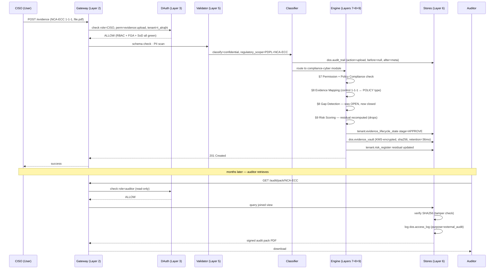

# GRC Data Flow Architecture

**Authoritative 12-layer reference architecture** for the DOS-AIO GRC automation framework — complete organizational data lifecycle, from initial capture through archival.

This document is the renderable companion to **Sections 14–18** of [`_consolidated_grc_content.sql`](_consolidated_grc_content.sql).

---

## 1. Master architecture diagram (canonical, 12 layers)

```mermaid
flowchart TB

%% =====================================================
%% STAKEHOLDERS / SOURCES
%% =====================================================
subgraph S["1. Data Sources / Stakeholders"]
  U1["Tenant Admin / Org Admin"]
  U2["Risk Owner / Control Owner"]
  U3["Auditor / Compliance Officer"]
  U4["Employee / Department User"]
  EXT1["External Integrations<br/>ERP / HR / IdP / SIEM / CMDB"]
  REG["Regulators / Standards<br/>NCA / SAMA / PDPL / ISO / NIST"]
end

%% =====================================================
%% CAPTURE LAYER
%% =====================================================
subgraph C["2. Capture & Intake Layer"]
  UI["UI-OS + Dynamic UI<br/>Forms / Widgets / Actions / Dashboards"]
  API["Gateway / API Layer<br/>Zod Validation + Auth Middleware"]
  IMPORT["Bulk Import / Connectors<br/>CSV / API / Scheduled Sync"]
  EVENTIN["Event Intake<br/>Webhook / Event Bus / SSE"]
end

U1 --> UI
U2 --> UI
U3 --> UI
U4 --> UI
EXT1 --> IMPORT
EXT1 --> EVENTIN
REG --> UI

UI --> API
IMPORT --> API
EVENTIN --> API

%% =====================================================
%% IDENTITY / ACCESS GOVERNANCE
%% =====================================================
subgraph IAM["3. Identity, Access Governance & Tenant Context"]
  KC["Keycloak<br/>Identity / SSO / Realm Roles"]
  DAUTH["DAuth<br/>Session / Claims / Tenant Context"]
  FGA["OpenFGA<br/>Relationship + Scope Authorization"]
  RBAC["RBAC Catalog<br/>Permissions / Functional Roles / Role Bindings"]
  TENANT["Tenant Context<br/>TenantId / TenantCode / Edition / Sector / Regulators"]
end

API --> DAUTH
DAUTH --> KC
DAUTH --> RBAC
DAUTH --> FGA
DAUTH --> TENANT

%% =====================================================
%% PROVISIONING / READINESS
%% =====================================================
subgraph P["4. Tenant & Module Provisioning Control"]
  PLAN["TenantProvisioningPlan<br/>Product + Edition + Modules + Role Grants"]
  PROV["Tenant Provisioning Orchestrator"]
  MODREADY["Module Readiness Contract<br/>Foundation / Risk / Compliance / Evidence"]
  DYNENROLL["Dynamic UI Enrollment<br/>Routes / Widgets / Actions / Agents"]
end

TENANT --> PLAN
PLAN --> PROV
PROV --> MODREADY
PROV --> DYNENROLL
PROV --> RBAC
PROV --> FGA

%% =====================================================
%% VALIDATION / NORMALIZATION
%% =====================================================
subgraph V["5. Data Validation & Normalization"]
  SCHEMA["Schema Validation<br/>Zod / DB Constraints"]
  RLS["Tenant Safety<br/>RLS / Tenant Schema / Cache Namespace"]
  DEDUPE["Deduplication + Identity Resolution"]
  CLASSIFY["Classification<br/>Criticality / Confidentiality / Regulatory Scope"]
end

API --> SCHEMA
SCHEMA --> RLS
RLS --> DEDUPE
DEDUPE --> CLASSIFY

%% =====================================================
%% DOMAIN DATA STORES
%% =====================================================
subgraph DB["6. Canonical Data Stores"]
  ORG["Foundation Data<br/>Organizations / BUs / Departments / Teams / Positions / Users"]
  GOV["Governance Data<br/>Policies / Committees / Ownership / Delegations"]
  RISK["Risk Data<br/>Risks / KRIs / Assessments / Treatments"]
  CTRL["Control Data<br/>Controls / Tests / Mappings / Obligations"]
  EVID["Evidence Vault<br/>Files / Attestations / Artifacts / Retention"]
  AUDIT["Immutable Audit Trail<br/>Who / What / When / Why / CorrelationId"]
end

CLASSIFY --> ORG
CLASSIFY --> GOV
CLASSIFY --> RISK
CLASSIFY --> CTRL
CLASSIFY --> EVID
CLASSIFY --> AUDIT

%% =====================================================
%% CONTROL POINTS
%% =====================================================
subgraph CP["7. Automated Control Points"]
  PERM["Permission Check<br/>Route / Action / Widget"]
  SOD["SoD Validation<br/>Conflict / Waiver / Maker-Checker"]
  WORKFLOW["Workflow Engine<br/>Approval / Review / Escalation"]
  POLICY["Policy Compliance Check<br/>Required Evidence / Due Dates / Exceptions"]
  DATAQ["Data Quality Gate<br/>Completeness / Freshness / Ownership"]
end

ORG --> PERM
GOV --> SOD
CTRL --> POLICY
RISK --> WORKFLOW
EVID --> DATAQ

PERM --> AUDIT
SOD --> AUDIT
WORKFLOW --> AUDIT
POLICY --> AUDIT
DATAQ --> AUDIT

%% =====================================================
%% COMPLIANCE VALIDATION
%% =====================================================
subgraph COMP["8. Compliance Validation & Evidence Mapping"]
  FRAME["Framework Mapping<br/>NCA / SAMA / ISO / NIST / PDPL"]
  OBL["Obligation Engine<br/>Control Requirements / Deadlines"]
  EVMAP["Evidence Mapping<br/>Control ↔ Evidence ↔ Owner"]
  GAP["Gap Detection<br/>Missing Evidence / Failed Tests / Expired Docs"]
end

REG --> FRAME
CTRL --> FRAME
FRAME --> OBL
OBL --> EVMAP
EVID --> EVMAP
EVMAP --> GAP
GAP --> RISK
GAP --> AUDIT

%% =====================================================
%% RISK INTEGRATION
%% =====================================================
subgraph RI["9. Risk Assessment Integration"]
  RISKREG["Risk Register"]
  SCORE["Risk Scoring<br/>Likelihood × Impact × Control Effectiveness"]
  TREAT["Treatment Plan<br/>Mitigate / Transfer / Accept / Avoid"]
  KRI["KRI Monitoring<br/>Thresholds / Trends / Breaches"]
end

ORG --> RISKREG
CTRL --> SCORE
GAP --> SCORE
SCORE --> TREAT
TREAT --> WORKFLOW
KRI --> RISKREG
RISKREG --> AUDIT

%% =====================================================
%% MONITORING / DETECTION
%% =====================================================
subgraph MON["10. Proactive Monitoring & Threat Detection"]
  METRICS["Metrics<br/>Control Health / SLA / Risk Heatmap"]
  EVENTS["Event Backbone<br/>Domain Events / State Changes"]
  ALERTS["Alerting<br/>Threshold Breach / Policy Violation / Suspicious Access"]
  AI["AI / Copilot Layer<br/>Next Best Action / Anomaly Detection / Summaries"]
end

ORG --> EVENTS
GOV --> EVENTS
RISK --> EVENTS
CTRL --> EVENTS
EVID --> EVENTS
EVENTS --> METRICS
METRICS --> ALERTS
EVENTS --> AI
ALERTS --> WORKFLOW
AI --> WORKFLOW
ALERTS --> AUDIT
AI --> AUDIT

%% =====================================================
%% CONSUMPTION / UI
%% =====================================================
subgraph OUT["11. Consumption, Reporting & Continuous Optimization"]
  DYN["Dynamic UI Runtime<br/>Visible Routes / Widgets / Actions"]
  DASH["Dashboards<br/>Executive / Operational / Control Owner"]
  REPORT["Reports<br/>Audit Pack / Regulatory Evidence / Board Reports"]
  OPT["Control Optimization<br/>Weak Control Detection / Policy Updates"]
end

DYNENROLL --> DYN
MODREADY --> DYN
RBAC --> DYN
FGA --> DYN
ORG --> DYN
RISK --> DASH
CTRL --> DASH
EVID --> REPORT
AUDIT --> REPORT
METRICS --> OPT
GAP --> OPT
OPT --> GOV
OPT --> CTRL
OPT --> RISK

%% =====================================================
%% ARCHIVAL
%% =====================================================
subgraph ARC["12. Retention, Archival & Legal Hold"]
  RET["Retention Policy<br/>By Regulator / Data Type / Tenant"]
  ARCH["Archive Store<br/>Cold Storage / Evidence Snapshots"]
  HOLD["Legal Hold<br/>Investigation / Audit Freeze"]
  PURGE["Controlled Purge<br/>Approved Expiry / Deletion Ledger"]
end

EVID --> RET
AUDIT --> RET
REPORT --> RET
RET --> ARCH
RET --> HOLD
RET --> PURGE
PURGE --> AUDIT

%% =====================================================
%% FEEDBACK LOOPS
%% =====================================================
AUDIT --> MON
REPORT --> OPT
OPT --> PLAN
PLAN --> PROV
```



---

## 2. Architecture intent (per layer)

| # | Layer | Purpose |
|---|---|---|
| 1 | **Sources / Stakeholders** | Tenants, owners, auditors, employees, integrations, regulators originate every byte that enters the system. |
| 2 | **Capture & Intake** | UI-OS / Dynamic UI · Gateway with Zod + Auth · bulk import connectors · event intake (webhook/bus/SSE). Single chokepoint into the platform. |
| 3 | **Identity, Access Governance & Tenant Context** | Every request passes Keycloak (identity) → DAuth (session/claims/tenant) → RBAC (permissions) → OpenFGA (relationship/scope) → Tenant Context (id/edition/sector/regulators) **before it touches business data**. |
| 4 | **Tenant & Module Provisioning Control** | `TenantProvisioningPlan` → Orchestrator → Module Readiness Contract (Foundation/Risk/Compliance/Evidence) → Dynamic UI Enrollment (routes/widgets/actions/agents). Capability availability is **declarative**, not script-derived. |
| 5 | **Data Validation & Normalization** | Schema (Zod + DB constraints) → tenant safety (RLS + schema isolation + cache namespace) → deduplication + identity resolution → classification (criticality / confidentiality / regulatory scope). |
| 6 | **Canonical Data Stores** | 6 domain-owned stores: Foundation · Governance · Risk · Controls · Evidence vault · **Immutable Audit Trail**. Single source of truth per domain. |
| 7 | **Automated Control Points** | Permission · SoD · Workflow · Policy · Data Quality. **Each writes to the audit trail** — control execution is itself evidence. |
| 8 | **Compliance Validation & Evidence Mapping** | Framework Mapping (NCA/SAMA/PDPL/ISO/NIST) → **Obligation Engine** (the granular layer between framework and control) → Evidence Mapping (control ↔ evidence ↔ owner) → Gap Detection (missing/failed/expired). Gap → Risk **and** Audit. |
| 9 | **Risk Assessment Integration** | Risk Register · Scoring (L × I × Effectiveness) · Treatment plan · KRI monitoring. Gaps from §8 feed scoring; treatment routes through §7 workflow. |
| 10 | **Proactive Monitoring & Threat Detection** | Metrics · Event Backbone · Alerts · AI/Copilot. Events from all canonical stores; alerts trigger workflow; AI feeds next-best-action and anomaly detection. |
| 11 | **Consumption, Reporting & Continuous Optimization** | Dynamic UI Runtime (gated by enrollment + RBAC + FGA) · Dashboards · Reports (audit packs / regulator evidence / board) · Control Optimization (weak control detection → back-feeds Gov/Ctrl/Risk). |
| 12 | **Retention, Archival & Legal Hold** | Retention policy by regulator+data-type+tenant → Archive store · Legal hold · Controlled purge. **Purge writes to audit trail** (deletion ledger). |

### Cross-layer feedback loops (the closed cycle)

| Loop | From → To | What turns |
|---|---|---|
| Audit → Monitoring | §6 AUDIT → §10 MON | Every action becomes a monitorable signal |
| Reports → Optimization | §11 REPORT → §11 OPT | Reported gaps drive control tuning |
| Optimization → Plan → Prov | §11 OPT → §4 PLAN → §4 PROV | Control changes re-provision modules/widgets/agents |
| Optimization → Gov/Ctrl/Risk | §11 OPT → §6 GOV/CTRL/RISK | Weak controls drive policy + control + risk updates |
| Gap → Risk | §8 GAP → §9 RISK | Missing evidence raises residual risk |
| KRI → Workflow | §10 ALERTS → §7 WORKFLOW | Threshold breach becomes an actionable task |
| AI → Workflow | §10 AI → §7 WORKFLOW | Next-best-action becomes assigned work |

---

## 3. Key design rule (operational invariant)

> **The data lifecycle should never depend on "page exists" or "table exists" as proof of readiness.**
>
> A capability is usable only when this chain is green:
>
> ```
> TenantProvisioningPlan
>   → module readiness
>   → schema/RLS
>   → RBAC
>   → OpenFGA scope
>   → seed/bootstrap data
>   → Dynamic UI enrollment
>   → API hydration
>   → audit trail
>   → monitoring evidence
> ```
>
> **That is what prevents empty workspaces, blank widgets, false compliance evidence, and uncontrolled access drift.**

This is the platform's core operational axiom. It is enforced by:
- §4 Module Readiness Contract — declarative gate per module
- §3 + §11 — Dynamic UI rendering blocked until RBAC + FGA + enrollment all green
- §6 + §7 — every state change writes audit trail
- §10 — monitoring evidence must exist for the capability to be considered "live"

---

## 4. Reconciliation with the existing implementation (§§1–17)

| Canonical layer | Implemented in | Gap to close |
|---|---|---|
| 1 Sources/Stakeholders | live (onboarding wizard, integrations, gateway) | — |
| 2 Capture & Intake | live (services/gateway + UI-OS) | — |
| 3 IAM & Tenant Context | live (Keycloak + DAuth + OpenFGA + Cerbos + RBAC catalogue 544 perms / 13 roles) | — |
| 4 **Tenant & Module Provisioning** | partial: `TenantProvisioningPlan` not yet declarative; orchestration is script-driven | **build declarative `TenantProvisioningPlan` schema + Module Readiness Contract registry** |
| 5 Validation & Normalization | live (Zod, RLS via `app.current_tenant_id`, search_path) | classification field on every row not yet universal |
| 6 Canonical Stores | partial: foundation/governance/risk/controls live; **evidence vault DDL only** (§16); immutable audit trail live (`dos.audit_trail`) | wire `dos.evidence_vault` storage layer (§16 has DDL) |
| 7 Automated Control Points | partial: SoD live (`dos.foundation_sod_rules`); workflow engine = Temporal; data-quality gates ad-hoc | unify data-quality gates as a single contract per module |
| 8 Compliance Validation | partial: framework mapping live; **Obligation Engine missing** | implement `obligation` table + engine between framework→control |
| 9 Risk Assessment | partial: risk_register DDL (§17); KRI buffer DDL (§16); scoring formula in §15 ARC 3 | wire scheduler emitting `dos.kri_observations` |
| 10 Monitoring & Threat Detection | partial: SIEM exists; AI agents A01-A13 live | unify alert routing into §7 workflow |
| 11 Consumption & Optimization | partial: Dynamic UI live; dashboards live; **OPT → GOV/CTRL/RISK back-feedback not wired** | implement weak-control detector + auto-update path |
| 12 Retention & Archival | partial: retention_months in §12; cold-tier DDL in §16 | provision Glacier-equivalent + nightly archival job |

---

## 5. Stakeholder access matrix

| Stakeholder | Layer 2 (capture) | Layer 6 (stores) | Layer 7 (controls) | Layer 11 (output) |
|---|---|---|---|---|
| Tenant Admin | onboarding wizard | own profile only | configures own SoD waivers | tenant dashboards |
| Risk Owner | risk submission | risk register (own scope) | approves treatments | risk dashboard, heatmap |
| Control Owner | control attestation | controls (own scope) | maker-checker | maturity dashboard |
| Auditor / Compliance | — | **read-only** all stores | views workflow audit trail | audit packs (signed) |
| Employee | self-service forms | own user profile | submits requests | personal inbox |
| Regulator | — | — | — | signed regulator submissions only |
| AI Agent | system events | tenant scope (svc role) | triggers workflows | AI summaries → inbox |
| Platform Ops | — | configures cross-tenant catalogue | configures global policies | platform-wide metrics |
| Board | — | — | — | Executive Command (aggregated, no PII) |

---

## 6. The byte path — single evidence item, end-to-end



---

## 7. Cross-reference to consolidated SQL file

| Canonical layer | Sections / DDL / functions in `_consolidated_grc_content.sql` |
|---|---|
| 1 Sources/Stakeholders | descriptive only |
| 2 Capture & Intake | services/gateway + products/shahin-ai/onboarding |
| 3 IAM & Tenant Context | platform/dauth/, RBAC catalogue (544 perms — see memory) |
| 4 Provisioning | §14 `fn_resolve_persona`, `sp_seed_tenant` · §17 tenant DDL · **§18** declarative provisioning plan (added next) |
| 5 Validation | Zod in services/gateway · `dos.audit_trail` in §1 |
| 6 Canonical Stores | §1 live tables · §11 dim_* + matrices · §12 controls/evidence/risk · §16 evidence_vault DDL · §17 tenant.* DDL |
| 7 Automated Control Points | `dos.foundation_sod_rules` in §1 · §15 ARC 4 lifecycle gates |
| 8 Compliance Validation | §11 dim_frameworks + matrix1-6 · §12 evidence_mapping · **Obligation Engine** = §18 next |
| 9 Risk Assessment | §15 ARC 3 (`fn_recompute_residual_risk`) · §16 `dos.kri_observations` · §17 `tenant.risk_register` |
| 10 Monitoring & Detection | §15 ARC 7 (cron drivers) · §16 `dos.access_log` · `dos.kri_observations` |
| 11 Consumption & Optimization | products/shahin-ai/cockpit · executive command · **OPT → back-feedback** = §18 next |
| 12 Retention & Archival | §12 evidence_types_ksa.retention_months · §16 `dos.archive_index` · `dos.disposal_certificate` |

---

## 8. What still needs wiring — the next concrete steps

The canonical model exposes 4 specific gaps to close before the loop is fully self-sustaining:

1. **Declarative `TenantProvisioningPlan`** (Layer 4) — replace script-driven provisioning with a typed plan: `{product, edition, modules[], role_grants[], readiness_gates[]}`. Drives orchestrator deterministically.
2. **Obligation Engine** (Layer 8) — the granular layer between framework and control. Today the platform jumps framework → control directly; obligations are what regulators audit against (e.g. PDPL Art-12 = breach notification within 72h → maps to N controls).
3. **Module Readiness Contract registry** (Layer 4) — per-module green/amber/red contract: schema migrated · RLS attached · seeds loaded · Dynamic UI enrolled · audit trail emitting · monitoring observed. Capability not exposed in UI until contract is green.
4. **OPT → GOV/CTRL/RISK back-feedback** (Layer 11) — automatic policy updates, control adjustments, and risk score recalibration when weak controls are detected.

These are scheduled as **Section 18** in the consolidated file.
