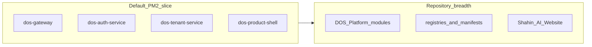

# 03 — Architecture and runtime inventory

**Company:** Dogan Consult · **Platform:** Dogan-AI OS · **Product example:** Shahin-AI

---

> **Post-restructure note (2026-04-29, Phase 3.5):** The inventory counts and
> repository layout below describe the **pre-restructure** state. Phase 3
> promoted six platform modules (DAuth, DOS, DSOC, DNOC, Dynamic UI, Foundation)
> into `platform/<x>/`, and Phase 3.5 standardized the 4 legacy
> `platform-module.manifest.json` files into canonical v1
> `module.manifest.json` files (with `kind:"platform"` + `lifecycle.stage:"ga"`).
> Legacy files are archived under `_quarantine/legacy-manifests/<x>/`.
> This document is retained as a historical snapshot.

---

## Repository areas inspected (evidence anchors)

| Area | Role |
|------|------|
| `DOS Platform/` | Module trees, manifests, Shahin-AI Website, registries |
| `services/` | Node microservices (30 top-level dirs) |
| `packages/` | Shared workspace packages (pnpm) |
| `ops/ecosystem.all.config.js` | PM2 default slice |
| `DOS Platform/registries/*.json` | Service + module registries |
| `docs/audits/dos-platform-inventory-2026-04-27.md` | Prior audit counts |

---

## Counts (from audit + spot checks)

| Metric | Value | Confidence |
|--------|-------|------------|
| Files under `DOS Platform/` | ~18,817 | CONFIRMED_IN_DOCS (audit) + NEEDS_RECOUNT if tree changed |
| `services/` top-level dirs | 30 | CONFIRMED_IN_CODE (`ls`) |
| `modules.registry.json` → `modules.length` | 72 | CONFIRMED_IN_CONFIG (`jq`) |
| `services.registry.json` → `serviceCode` occurrences | 37 | CONFIRMED_IN_CONFIG (`grep -c`) |
| `module.manifest.json` under DOS Platform | 32 | CONFIRMED_IN_CODE (`find`) |
| `platform-module.manifest.json` | 4 | CONFIRMED_IN_CODE (`find`) |
| PM2 apps in `ecosystem.all.config.js` | 4 | CONFIRMED_IN_CONFIG |

---

## Gateway (auth path)

Gateway `package.json` documents Keycloak issuer/JWKS env vars and proxy routing to auth and tenant services.

```yaml
claim: "Gateway lists KEYCLOAK_ISSUER_URL, KEYCLOAK_JWKS_URL, proxy to auth/tenant"
confidence: CONFIRMED_IN_CONFIG
evidence:
  - path: "services/gateway/package.json"
```

---

## Workspace packages

`pnpm-workspace.yaml` includes `packages/*`, `services/*`, `frontend/*`, `DOS Platform/Shahin-AI Website/frontend`, and several `@dos/*` / `@shahin/*` packages.

```yaml
claim: "pnpm workspace members include DOS Platform Shahin frontend and dos/shahin packages"
confidence: CONFIRMED_IN_CONFIG
evidence:
  - path: "pnpm-workspace.yaml"
```

---

## Mermaid (high level)



---

## NEEDS_RUNTIME_VERIFICATION

- End-to-end JWT validation against a live Keycloak.  
- Database connectivity per service.  
- Which routes the gateway actually mounts vs registry-only entries.
