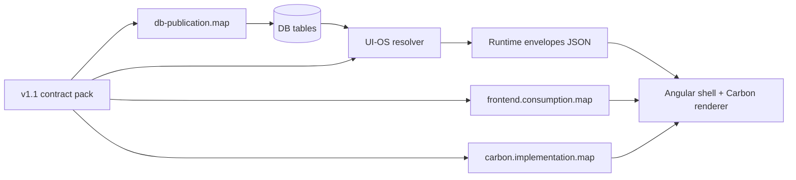

# dogan_shahin_all_contracts_v1_1_operating_runtime

Operating runtime contract pack for the Dogan AI Platform, hosting product Shahin GRC. Self-contained sibling of the frozen v1 pack at `../dogan_shahin_all_contracts_v1_runtime/`.

## Doctrine

`ZERO_STATIC` `ZERO_LEGACY` `ZERO_FALLBACK` `ZERO_BROWSER_NORMALIZATION` `DB_AS_SOURCE_OF_TRUTH`.

DB stores. Dynamic UI declares. UI-OS resolver normalizes. Frontend renders only normalized UI-OS runtime. If UI-OS emits nothing, frontend shows nothing.

## Boundary for this step

- Pack-authoring only.
- No DB execution.
- No resolver edits.
- No frontend edits.
- No CI auto-wiring of preflight SQL.
- v1 pack remains frozen as historical archive.
- Resolver loads v1.1 only in a later step.

## What this pack adds on top of v1

| Layer | File |
| --- | --- |
| Shell operating contract | `workspace/shahin.workspace.contract.v1-1.json` |
| Product runtime contract | `product/shahin.product.contract.v1-1.json` |
| Module runtime contracts | `modules/*.module.contract.v1-1.json` (24 files) |
| Tenant runtime contract | `tenant/tenant.runtime.contract.v1-1.json` |
| Integration runtime contract | `integrations/integration.runtime.contract.v1-1.json` |
| Theme/system color contract | `theme/theme.system.contract.v1-1.json` |
| Carbon implementation map | `registries/carbon.implementation.map.v1-1.json` |
| DB publication map | `publication-map/db-publication.map.v1-1.json` + `publication-map/publication.lockstep.json` |
| Resolver envelope map | `envelopes/*.envelope.v1-1.json` (6 files) |
| Frontend consumption map | `consumption-map/frontend.consumption.map.v1-1.json` |
| Preflight defects (paired SQL + JSON) | `preflight/blockers.contract.v1-1.json` + `preflight/migrations/01..04*.sql` + `preflight/lockstep.proof.json` |
| CI guard spec (doc-only) | `ci/ci.manifest.v1-1.json` |

Plus regenerated v1 surfaces:

- `platform/dogan-ai-os.platform.contract.v1-1.json`
- `registries/component-capability-registry.v1-1.json`
- `registries/route-catalog.v1-1.json`
- `registries/permission-catalog.v1-1.json`

## Layer flow

## Runtime endpoints declared

- `GET /api/ui-os/workspace-runtime`
- `GET /api/ui-os/product-runtime`
- `GET /api/ui-os/module-runtime/:moduleCode`
- `GET /api/ui-os/tenant-runtime`
- `GET /api/ui-os/integration-runtime`
- `GET /api/ui-os/theme-runtime`

Each endpoint shape is fixed by the matching file under `envelopes/`.

## Preflight blockers (4)

- B1 — `dos.mobile_component_variants.is_default` with tenant-scoped uniqueness.
- B2 — Foundation `item_id` hyphen/underscore drift, fixed via explicit canonical mapping (no generic `replace`).
- B3 — `dos.product_registry.tier` column + check constraint, added via `pg_constraint` guarded `DO` block.
- B4 — Canonical `dos.tenants` DDL, marked `review_required = true`.

Manifest: `preflight/blockers.contract.v1-1.json`. SQL: `preflight/migrations/0[1-4]_*.sql`. Lockstep proof placeholder: `preflight/lockstep.proof.json` (populated by CI guard in a later step).

## CI guards (6, doc-only declaration)

`ci/ci.manifest.v1-1.json` declares:

- `lint-v1-1-self-contained`
- `lint-v1-1-preflight-lockstep`
- `lint-v1-1-publication-coverage`
- `lint-v1-1-envelope-coverage`
- `lint-v1-1-no-auto-execute`
- `lint-v1-1-no-frontend-invention`

These are wired into `scripts/ci-guards/dos-master-gate.mjs` in a later step. No script under `scripts/ci-guards/` is created or modified by this pack.

## What this pack does NOT do

- Execute any preflight SQL.
- Modify the resolver in `services/ui-os-service/src/routes/`.
- Modify any Angular component.
- Add or modify any CI script.
- Mutate the v1 pack.
- Remove the mobile route channel (deferred).
- Probe any runtime endpoint.

These follow once the v1.1 pack is approved.

## Acceptance gates

1. v1.1 folder exists with all files listed in `contract.index.v1-1.json`.
2. Every v1.1 contract validates as JSON and contains both the v1 surface and the new operating layers.
3. `preflight/blockers.contract.v1-1.json` contains exactly 4 entries, each linked to one SQL file with matching SHA-256 checksum.
4. Every preflight SQL is idempotent and either non-destructive or marked `review_required = true`.
5. `db-publication.map.v1-1.json` covers every contract field (zero orphans).
6. Every envelope file is referenced by at least one contract and one consumption-map entry.
7. Frozen v1 pack remains untouched (zero diff under `dogan_shahin_all_contracts_v1_runtime/`).
8. No resolver, frontend, or CI files mutated. No SQL executed.
